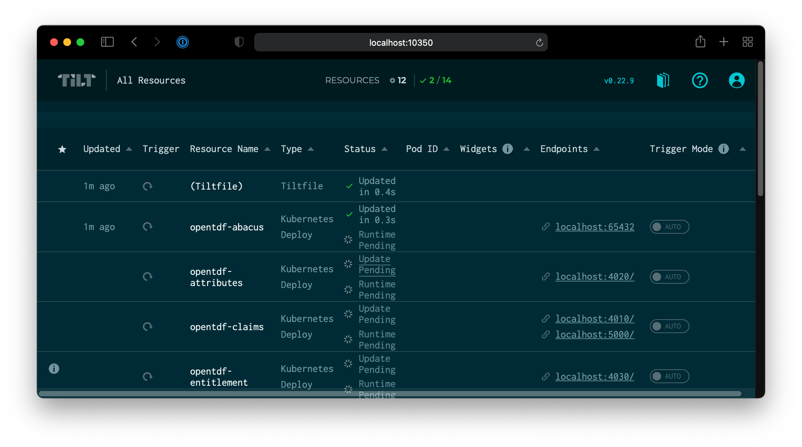
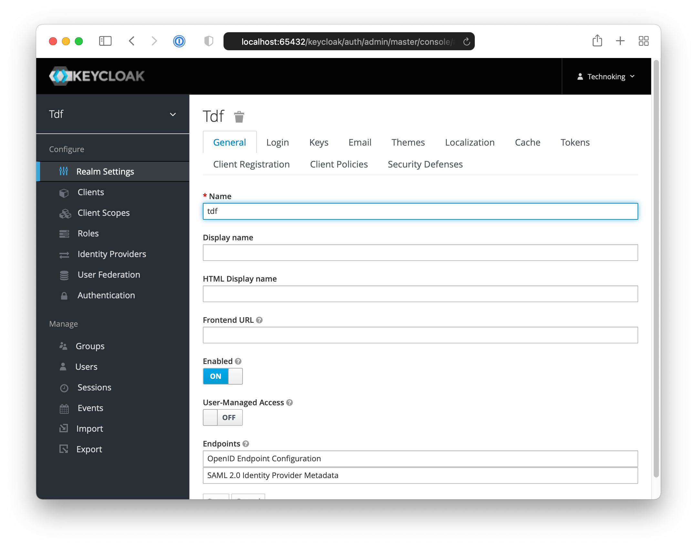
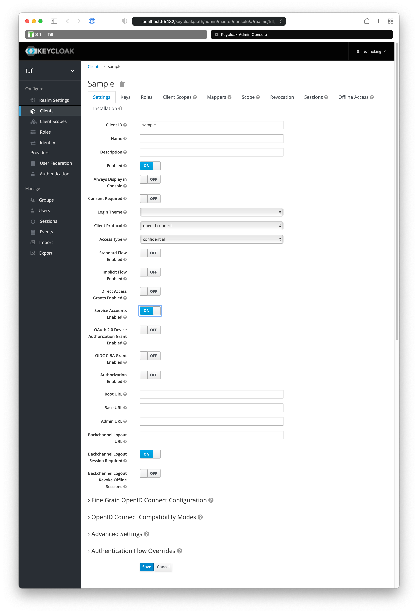
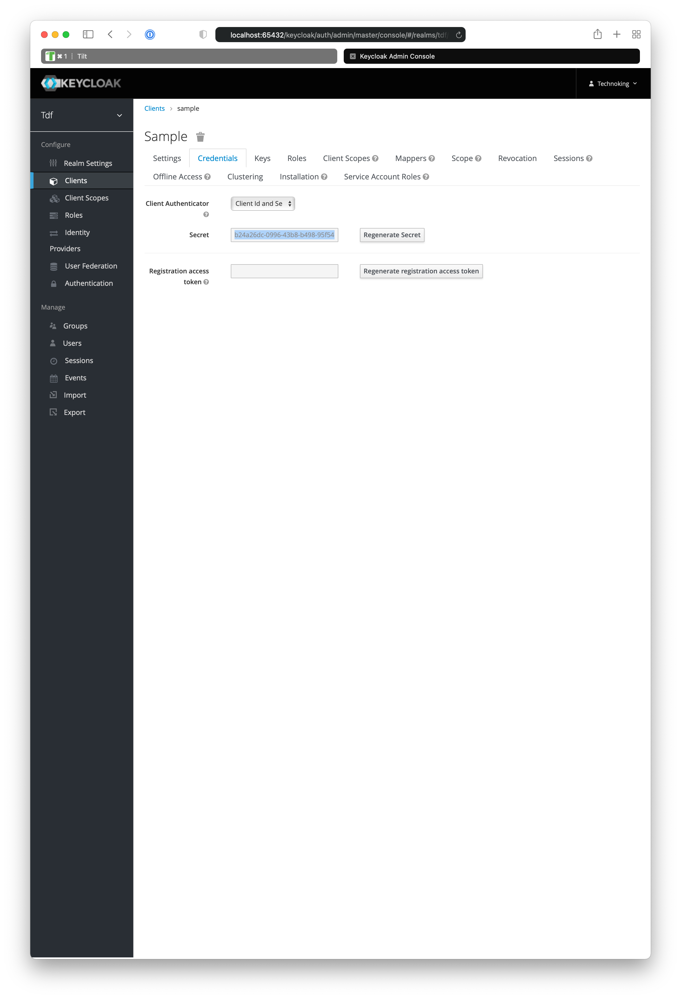
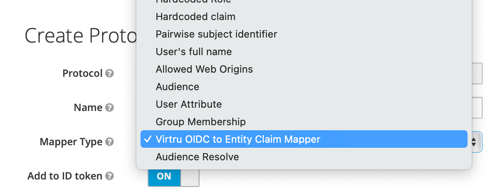
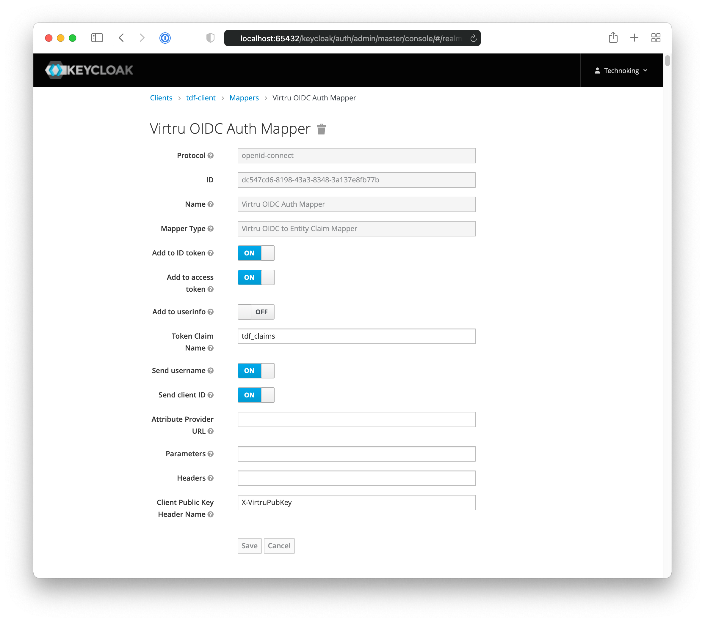

# Using OpenTDF from Python

This example demonstrates:

 - Connecting to an OIDC backend via client credentials
 - Encrypting a file with a TDF container and assigning a data attribute
 - Decrypting the file

For more details, refer to the
[Client Source repository](https://github.com/opentdf/client-cpp).

### Start services

This demo uses a local backend. For details on installing the pre-requisites,
follow [the quickstart](../../quickstart/).

```shell
tilt up
```


If you click `space`, you can follow along from a web browser as the services come up.



## Writing a Client with Python

We have a quick sample script in this folder, [`main.py`](./main.py). This script uses client credentials to acquire an OIDC jwt, and then uses that to encrypt and decrypt a small text file.

### Install client library

```shell
pip3 install --upgrade opentdf
```

### Execute client to encrypt and decrypt

```shell
python3 main.py
```

See success message
```text
TDF Encrypt/Decrypt is successful!!
Nano TDF Encrypt/Decrypt is successful!!
```

## Configuring a new Client

However, you probably will want to secure your client manually. Do create a new set of client credentials, go to your running keycloak by clicking on the link in the tilt dashboard, found in the row labelled `keycloak`.


From there, log in to the `Administration Console`.


Log in with the test credentials found in [the helm values file](../../quickstart/helm/secrets/templates/secrets.yaml#L64-L65). This will bring you to the realm, configured with the bootstrap job.



To create a new client, from the `Clients` panel, click the new client button. The new client must be confidential with only service accounts enabled. To reveal this configuration, first set the **Access Type** to **Confidential**. Then toggle the **Service Accounts Enabled** ON. This will let you generate a client authentication token pair. When you save this, it will enable a 'Credentials' tab.



Under 'Credentials, create a new client id and secret. Save the secret to a secure place. (The client id is name you gave it on the primary tab, 'Settings'.)



To associate a client with a set of entitlements, we must add the Auth and UserInfo mappers. 



A configured mapper should appear as follows:


