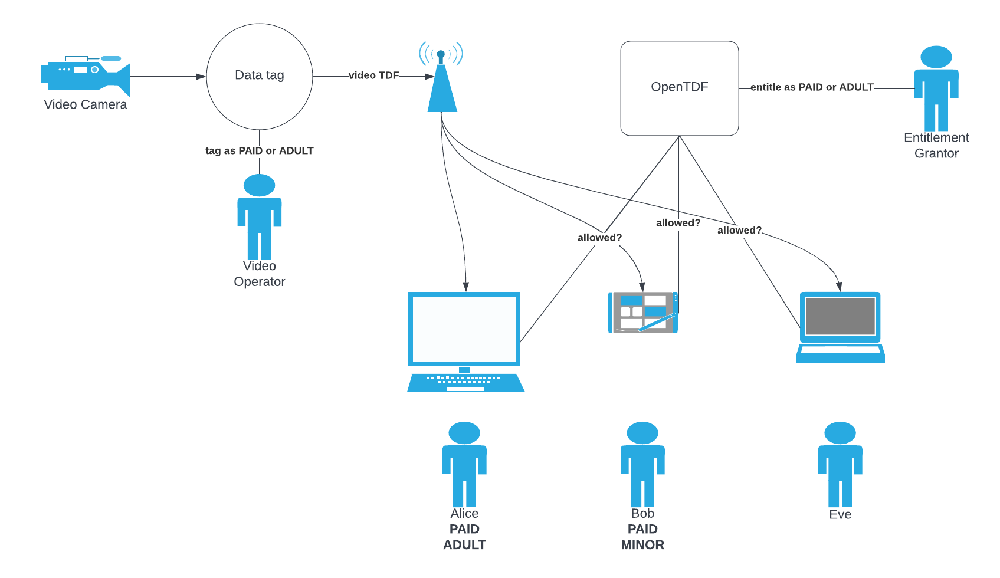

# webcam-app 
Full-motion video with OpenTDF

## Topics covered

- Encrypt a video stream with the high performant NanoTDF Dataset client
- Protect a video stream via data tagging with attributes
- Entitle users and web apps to view the video stream

## Steps

1. Click **Login** to login all users using OIDC
2. Click **Webcam** to start your webcam and the video stream
3. As the _Video Operator_, click **Premium** to tag the video stream for consumption by paid users only (Alice, Bob)
4. As the _Entitlement Grantor_, click **Abacus**, login user1/testuser123, go to **Entitlements** and remove _Premier_ from Alice

## Setup

1. Start Examples backend.  `cd examples` then `tilt up`  
2. The library is published to GitHub Packages instead of npmjs.com.  Setup NPM to download it here: https://docs.github.com/en/packages/working-with-a-github-packages-registry/working-with-the-npm-registry#authenticating-to-github-packages 
3. `cd webcam app` then `npm install` and `npm run start` - follow Steps above 
