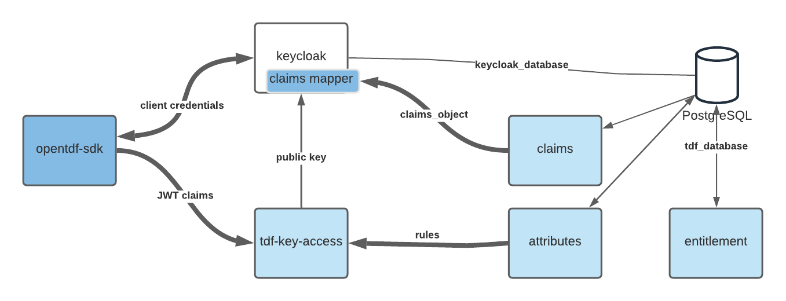
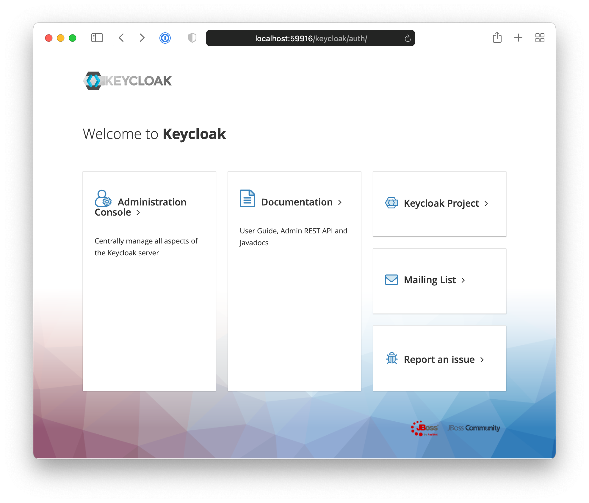

# opentdf Quickstart

**_Not for production_**

A quick (less than 10 minutes) and easy process to protect data with TDF using the opentdf stack.

## Getting a Local Backend Up and Running

### Prerequisites

- Install [Docker](https://www.docker.com/)

  - see https://docs.docker.com/get-docker/

- Install [kubectl](https://kubernetes.io/docs/reference/kubectl/overview/)

  - On macOs via Homebrew: `brew install kubectl`
  - On Linux or WSL2 for Windows: `curl -LO "https://dl.k8s.io/release/$(curl -L -s https://dl.k8s.io/release/stable.txt)/bin/linux/amd64/kubectl" && chmod +x kubectl && sudo mv kubectl /usr/local/bin/kubectl`
  - Others see https://kubernetes.io/docs/tasks/tools/

- Install [kind](https://kind.sigs.k8s.io/)

  - On macOS via Homebrew: `brew install kind`
  - On Linux or WSL2 for Windows: `curl -Lo kind https://kind.sigs.k8s.io/dl/v0.11.1/kind-linux-amd64 && chmod +x kind && sudo mv kind /usr/local/bin/kind`
  - Others see https://kind.sigs.k8s.io/docs/user/quick-start/#installation

- Install [helm](https://helm.sh/)

  - On macOS via Homebrew: `brew install helm`
  - On Linux or WSL2 for Windows: `curl -LO https://get.helm.sh/helm-v3.7.0-linux-amd64.tar.gz && tar -zxvf helm-v3.0.0-linux-amd64.tar.gz && chmod +x linux-amd64/helm && sudo mv linux-amd64/helm /usr/local/bin/helm`
  - Others see https://helm.sh/docs/intro/install/

- Install [Tilt](https://tilt.dev/)
  - On macOS via Homebrew: `brew install tilt-dev/tap/tilt`
  - On Linux or WSL2 for Windows: `curl -fsSL https://github.com/tilt-dev/tilt/releases/download/v0.22.9/tilt.0.22.9.linux.x86_64.tar.gz | tar -xzv tilt && sudo mv tilt /usr/local/bin/tilt
  - Others see https://docs.tilt.dev/install.html

### Pull repository

```shell
git clone https://github.com/opentdf/documentation.git
cd documentation/quickstart
```

### Create cluster

`kind create cluster --name opentdf`

### Start services

```shell
tilt up
```

#### Monitor services

Hit (space) and wait for all resources to turn green.  
Or go to http://localhost:10350/

Services should be up in 4-6 minutes.

##### Optional

- Install [Octant](https://octant.dev/)

  - On macOS via Homebrew: `brew install octant`
  - Others see https://docs.vmware.com/en/VMware-vSphere/7.0/vmware-vsphere-with-tanzu/GUID-1AEDB285-C965-473F-8C91-75724200D444.html

- Run the `octant` command in any terminal window to
  open a more detailed services dashboard.

## Writing a Client with Python

### Install client library

```shell
pip3 install --upgrade opentdf
```

### Execute client to encrypt and decrypt

```shell
python3 tests/oidc-auth.py
```

See success message

```text
TDF3 Encrypt/Decrypt is successful!!
Nano TDF Encrypt/Decrypt is successful!!
```

See the TDF files under `documentation/quickstart/tests`  
Report errors to <MAILTO:openstack-team@virtru.com>

### Clean up

```shell
tilt down
kind delete cluster --name opentdf
pip3 uninstall opentdf
```

## Overview



### Client

See [the opentdf/client readme](https://github.com/opentdf/client) for details about how to configure a Python or C++ application to use opentdf.

### Services

#### attributes

Manage attributes with rules used in ABAC  
OpenAPI http://localhost:4020/docs

#### Abacus

The abacus web service provides a visual management interface for entitlements and attribute rules.

To access, `tilt up` and navigate to `https://localhost:65432`.


Abacus will automatically forward you to the login screen to acquire user credentials.


Log in using the credentials generated with the bootstray script, or using [the manual script below](#configuring-user-permissions-with-abacus). These are currently "user1" and the password is "password".


If your credentials are accepted, keycloak will redirect you to the abacus home screen. If your credentials are not accepted, you can log in to keycloak separately with the client credentials and fix the user login information.


From here, you can get a list of attributes or entities.


#### Configuring user permissions with Abacus

Abacus provides a front-end that links a keycloak identity provider with a custom attribute-based access control system.
To log in and use abacus itself, you must create and use _User_ accounts in the _tdf_ realm of the associated keycloak service.

To create an abacus login, open up keyloak, which will be available at [port 65432](http://localhost:65432/keycloak/auth/).



Log in with the credentials generated by the [values fed into the bootstrap script](quickstart/helm/opentdf/charts/bootstrap/values.yaml), currently `keycloakadmin`. The corresponding password is found there as well.

The bootstrap script also binds this client to a custom, opentdf attribute mapper, which allows the entitlement service to link attributes to given subjects, either clients (NPE subjects that act as services or service providers) or users and services that act on behalf of a single account.

[!Screenshot of the keycloak mappers settings for a tdf client](static/keycloak-tdfclient-mappers.png)

If want to modify this sample to deploy to another domain, redirect and web origins need too be set under client > tdf-\* > settings

[!Screenshot of the keycloak mappers settings for a tdf client](static/keycloak-tdfclient-mappers.png)

Abacus users are keycloak users that have aud: `tdf-entitlement`. Unique for public access with standard flow, you need this or you will see an error saying ‘audience is not correct’.

[!A decoded jwt, which has the audience tdf-entitlement](static/jwt-aud.png)

In the users panel, to grant a user access to abacus to view and edit attributes, they must be associated with the realm role, `default-tdf-role`. To grant them access to list and view entities, required to assign attributes to a user, you must also grant them the `realm-management` roles `view-events` and `view-users`.

[!A screenshot of the keycloak interface to assign client roles to a user, set with permissions to allow a user to list and edit user credentials in abacus](static/keycloak-users-rolemappings.png)

#### entitlement

Manage assignment of attributes to entities  
OpenAPI http://localhost:4030/docs

#### claims

Read the attributes that have been assigned to an entity

#### key-access

Access control of the key using ABAC  
Swagger http://localhost:8080/kas/ui/ (update `/kas/openapi.json`)

## Solutions

See [Solutions](../solutions) page on how to integrate opentdf.

## Troubleshoot

If you need to restart, delete cluster and try again

```shell
kind delete cluster --name opentdf
kind create cluster --name opentdf
```

---

After `tilt up` and hitting (space), and have trouble opening tilt UI with http://localhost:10350/ in Chrome

- Go to chrome://net-internals/#hsts
- Type `localhost` in Delete domain security policies section and hit DELETE button

---

```text
Error: writing tilt api configs: open /path/to/.tilt-dev/config.lock: file exists
```

```shell
rm -f /path/to/.tilt-dev/config.lock
```

---

A stuck Status of "Runtime Pending" on a postgresql:statefulset.  
Trigger a restart manually, once or twice.

---

```text
python3 tests/oidc-auth.py
Unexpected error: <class 'RuntimeError'>
Traceback (most recent call last):
  File "/Users/paul/Projects/opentdf-aux/documentation/quickstart/tests/oidc-auth.py", line 26, in <module>
    client.encrypt_file("sample.txt", "sample.txt.tdf")
RuntimeError: Error code 1.  [oidc_service.cpp:168] Get OIDC token failed status: 404{"error":"Realm does not exist"}
```

Wait. All services aren't up, namely keycloak.

---

Port conflicts  
check that ports used in `Tiltfile` are not used on the host

---

attribute-provider: Name or service not known  
hard-coded value in keycloak-bootstrap?

---

Database connection issue

```angular2html
pg_isready --dbname=tdf_database --host=opentdf-postgresql --port=5432 --username=postgres
```
